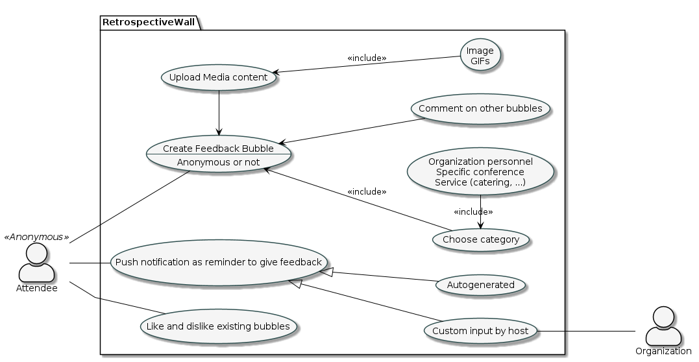
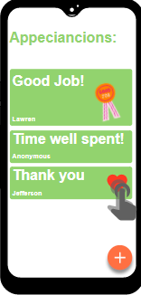
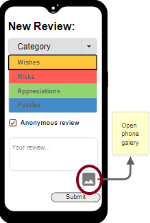
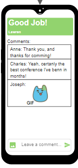
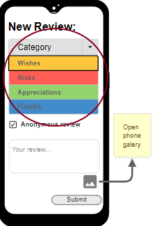
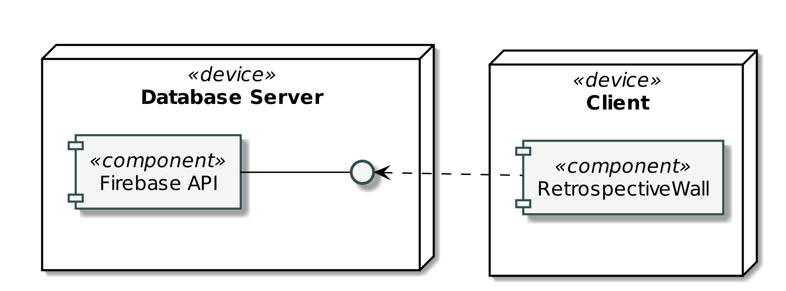

# openCX-*your module name* Development Report

Welcome to the documentation pages of the *your (sub)product name* of **openCX**!

You can find here detailed about the (sub)product, hereby mentioned as module, from a high-level vision to low-level implementation decisions, a kind of Software Development Report (see [template](https://github.com/softeng-feup/open-cx/blob/master/docs/templates/Development-Report.md)), organized by discipline (as of RUP): 

* Business modeling 
  * [Product Vision](#Product-Vision)
  * [Elevator Pitch](#Elevator-Pitch)
* Requirements
  * [Use Case Diagram](#Use-case-diagram)
  * [User stories](#User-stories)
  * [Domain model](#Domain-model)
* Architecture and Design
  * [Logical architecture](#Logical-architecture)
  * [Physical architecture](#Physical-architecture)
  * [Prototype](#Prototype)
* [Implementation](#Implementation)
* [Test](#Test)
* [Configuration and change management](#Configuration-and-change-management)
* [Project management](#Project-management)

So far, contributions are exclusively made by the initial team, but we hope to open them to the community, in all areas and topics: requirements, technologies, development, experimentation, testing, etc.

Please contact us! 

Thank you!

Iohan Xavier Sardinha Dutra Soares (up201801011@fe.up.pt)

João António Cardoso Vieira e Basto Sousa (up201806613@fe.up.pt)

João Luís Cardoso Rodrigo (up201705110@fe.up.pt)

Rafael Soares Ribeiro (up201806330@fe.up.pt)

Tomás Costa Fontes (up201806252@fe.up.pt)

---

## Product Vision
A place where conference attendees can express their satisfaction with the different aspects of the conference, giving feedback to the organizers in real time, through an intuitive, interactive and interesting interface.

---
## Elevator Pitch
Have you ever faced any issue in an online conference but didn't know where or who to transmit them to or even found the process difficult and time-consuming?
We are the Esoterics and our work focus on exactly that: provide a straight-forward way to deliver the atendees' feedback to the organizers, by streamlining the gathering of points of view from the participants via the feedback bubbles. By simply creating a feedback bubble, commenting on an existing issue or even by just pointing out positives of an event, anyone taking part can express their opinion on the event(s) and therefore empowering the people in charge to perform on the fly adjustments to fix the issues that get reported, improving the experience of all parties involved.

<!-- 
Draft a small text to help you quickly introduce and describe your product in a short time and a few words (~800 characters), a technique usually known as elevator pitch.

Take a look at the following links to learn some techniques:
* [Crafting an Elevator Pitch](https://www.mindtools.com/pages/article/elevator-pitch.htm)
* [The Best Elevator Pitch Examples, Templates, and Tactics - A Guide to Writing an Unforgettable Elevator Speech, by strategypeak.com](https://strategypeak.com/elevator-pitch-examples/)
* [Top 7 Killer Elevator Pitch Examples, by toggl.com](https://blog.toggl.com/elevator-pitch-examples/) 
-->

---
## Requirements

### Use case diagram 

 

#### Like or Dislike Feedback Bubles
* **Actor**. Attendees
* **Description**. Choose to either like or deslike an existing bubble in order to enhance (or not) the feedback credibility. (Liking the bubble will make it grow, while disliking it will make it smaller.
* **Preconditions and Postconditions**. A feedback bubble must exist so that it can be liked/disliked
- **Normal Flow:**
  - User presses like button on the feedback bubble
    - System will make that bubble bigger
  - User presses dislike button on the feedback bubble
    - System will make that bubble smaller
    
#### Creating Feedback Pop-up question
* **Actor**. Metting's host
* **Description**. Host can create questions that pop after the meeting ends in order to get attendees opinion on a specific subject.
* **Preconditions and Postconditions**. Metting has to end.
- **Normal Flow:**
 
  - Host creates question
  - System makes it pop up attendees screen.
 
 #### Cometing on Feedback bubbles
* **Actor**. Attendee
* **Description**. Attendees can comment on other's feedback in order to add some information they think might be needed.
* **Preconditions and Postconditions**. Feedback buble must exist in so that it can be commented.
- **Normal Flow:**
  - Attendee chooses wich feedback bubble he wants to comment on.
  - Attendee is given a text box to write and an option to phone's gallery if he wishes to add a photo or a gif.
  - Attendee submits his comment.

#### Create Feedback bubble
- **Actor:** Attendee.
- **Description:** The base functionality of the app, the ability to create a bubble describing an issue or idea. These belong to a specific category (*Wishes, Risks, Appreciations, Puzzles*) and may pertain to something more specific inside the event (*a specific talk, branch of the organization, ...*)
- **Preconditions and Postconditions:** The only precondition is to have the app installed on the device. Since the use of an account is not mandatory, the user can create bubbles from the *get-go*.
- **Normal Flow:**
  - User provides a title.
  - User chooses category from drop-down list.
  - User chooses if the feedback is anonymous.
  - User provides a description of the feedback. 
  - User submits form and bubble is created
- **Alternative Flows and Exceptions:** The user can leave the creation process *midway through*, which will cancel the creation of the feedback

### User stories

<!-- 
This section will contain the requirements of the product described as **user stories**, organized in a global **[user story map](https://plan.io/blog/user-story-mapping/)** with **user roles** or **themes**.

For each theme, or role, you may add a small description. User stories should be detailed in the tool you decided to use for project management (e.g. trello or github projects).

A user story is a description of desired functionality told from the perspective of the user or customer. A starting template for the description of a user story is  
-->

#### Story 1: Feedback Bubbles's creation
> As a user I want to be able to create a Feedback Bubbles so that I can express my review about the meeting.

**Scenario: Create feedback buble**

**Given** the meeting has ended and I'm on the create feedback page and have finished filling all details (feedback text, tittle, images),

**When** I click Submit button,

**Then** the app uploads the feedback I just wrote.

***
#### Story 2:As a user I want to be able to choose an area of the board to write on so that I can specify how positive or negative the feedback is.

***
#### Story 3:Like or Dislike feedback bubbles
> As a user I want to be able to like or dislike existing feedback bubbles so that I show my agreement/disagreement with others.

**Scenario: Like or Dislike feedback bubles**

**Given** I’m on a certain page of feedbacks

**When** I click the upvote(1)/downvote(2) on a specific feedback bubble,

**Then** it grows(1)/diminishes(2) and updates the number of votes.

***
#### Story 4: Anonymous review
> As a user I want to able to have the option to hide my identity so that the feedback can be anonymous.

**Scenario: Give feedback anonymously**

**Given** I’m on the create feedback page

**When** I check the anonymous review box,

**Then** when I submit my feedback it will be anonymous.

***
#### Story 5: Add Images/Gifs
> As a user I want to be able to add images or gif to my feedback/comment so that I can better express my opinion.

**Scenario: Add images/gifs to feedback**

**Given** I’m on the create feedback page

**When** I click the photo logo,

**Then** I can choose photos or gifs to attach to my feedback.

***
#### Story 6: Comment Feedback Blubles
> As a user I want to be able to comment on Feedback Bubbles so that I can add an opinion about an existing feedback review.

**Scenario: Comment on existing feedbacks**

**Given** I’m on a specific feedback page

**When** I fullfill the textbox space (and add image if desired) and press the arrow logo,

**Then** my comment on that feedback is posted.

***
#### Story 7:As a host I want to be able to create custom Feedback questions so that I can gather opinions about a specific topic or issue.

***
#### Story 8:As a host I want to be able to search feedbacks by category/subject so that I can look for feedback about a specific subject.

***
#### Story 9: Selecting Category of my feedback
> As a user I want to associate a specific talk, event or area of the organization to my Feedback so that I can better direct my criticism

**Scenario: Selecting Category of my feedback**

**Given** I’m on the create feedback page

**When** choose a category for my feedback (from the ones given),

**Then** my feedback becomes associated with that tag.

***

<!-- 
**INVEST in good user stories**. 
You may add more details after, but the shorter and complete, the better. In order to decide if the user story is good, please follow the [INVEST guidelines](https://xp123.com/articles/invest-in-good-stories-and-smart-tasks/).
 -->

**User interface mockups**.
<!-- 
After the user story text, you should add a draft of the corresponding user interfaces, a simple mockup or draft, if applicable. 
-->

**Acceptance tests**.
For each user story you should write also the acceptance tests (textually in Gherkin), i.e., a description of scenarios (situations) that will help to confirm that the system satisfies the requirements addressed by the user story.

**Value and effort**.
At the end, it is good to add a rough indication of the value of the user story to the customers (e.g. [MoSCoW](https://en.wikipedia.org/wiki/MoSCoW_method) method) and the team should add an estimation of the effort to implement it, for example, using t-shirt sizes (XS, S, M, L, XL).

### Domain model

<!-- 
To better understand the context of the software system, it is very useful to have a simple UML class diagram with all the key concepts (names, attributes) and relationships involved of the problem domain addressed by your module.
 -->

---

## Architecture and Design

### Logical architecture

Like most projects of this nature usually do, we adopted the *MVC* pattern. A central "Controller" is in charge of receiving inputs from the user and updating the corresponding model, which in turn triggers changes in the view of this component.

### Physical architecture

Architecturally, our project is split in two parts: 
- The **Client side**, which consists of both the *Attendee* and the *Organization* apps.
- The **Server side**, where the *Firebase* database lives and stores all users' data .

The technologies we chose were *Flutter*, so in the end it would be easier to merge with the **open-cx** project and our class' work, and *Firebase*, since it fit well into our needs and would be simpler than handling the *back-end* ourselves.  
The *FlutterFire* library's components take care of all the communication with the database, and this ease of mind was a major deciding factor for us.

### Prototype

<!-- 
To help on validating all the architectural, design and technological decisions made, we usually implement a vertical prototype, a thin vertical slice of the system.

In this subsection please describe in more detail which, and how, user(s) story(ies) were implemented.
 -->
---

## Implementation
<!-- 
Regular product increments are a good practice of product management. 

While not necessary, sometimes it might be useful to explain a few aspects of the code that have the greatest potential to confuse software engineers about how it works. Since the code should speak by itself, try to keep this section as short and simple as possible.

Use cross-links to the code repository and only embed real fragments of code when strictly needed, since they tend to become outdated very soon.
 -->

---
## Test
<!-- 
There are several ways of documenting testing activities, and quality assurance in general, being the most common: a strategy, a plan, test case specifications, and test checklists.

In this section it is only expected to include the following:
* test plan describing the list of features to be tested and the testing methods and tools;
* test case specifications to verify the functionalities, using unit tests and acceptance tests.
 
A good practice is to simplify this, avoiding repetitions, and automating the testing actions as much as possible.
 -->

---
## Configuration and change management

<!-- 
Configuration and change management are key activities to control change to, and maintain the integrity of, a project’s artifacts (code, models, documents).

For the purpose of ESOF, we will use a very simple approach, just to manage feature requests, bug fixes, and improvements, using GitHub issues and following the [GitHub flow](https://guides.github.com/introduction/flow/).
 -->

---

## Project management

<!-- 
Software project management is an art and science of planning and leading software projects, in which software projects are planned, implemented, monitored and controlled.

In the context of ESOF, we expect that each team adopts a project management tool capable of registering tasks, assign tasks to people, add estimations to tasks, monitor tasks progress, and therefore being able to track their projects.

Example of tools to do this are:
  * [Trello.com](https://trello.com)
  * [Github Projects](https://github.com/features/project-management/com)
  * [Pivotal Tracker](https://www.pivotaltracker.com)
  * [Jira](https://www.atlassian.com/software/jira)

We recommend to use the simplest tool that can possibly work for the team.
 -->

See our progress through our [project board](https://github.com/FEUP-ESOF-2020-21/open-cx-t5g2-esotericos/projects/1).

---

## Evolution - contributions to open-cx
<!-- 
Describe your contribution to open-cx (iteration 5), linking to the appropriate pull requests, issues, documentation. 
-->